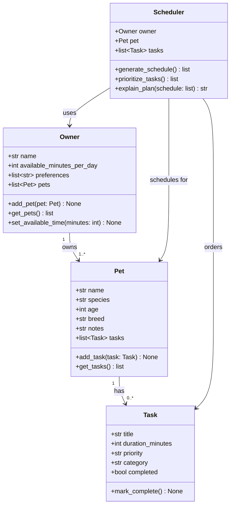

# PawPal+ Project Reflection

## 1. System Design

### Core User Actions

The three core actions a PawPal+ user should be able to perform are:

1. **Register their pet** — Enter basic information about their pet (name, species, age, breed) so the system can tailor care recommendations appropriately.
2. **Add and manage care tasks** — Create tasks like walks, feeding, medication, and grooming, each with a duration (in minutes) and a priority level (low / medium / high).
3. **Generate today's daily care plan** — Ask the system to produce an ordered schedule of tasks that fits within the owner's available time, prioritizing the most important tasks first, and explain why each task was included.

**a. Initial design**

The system is built around four classes:

- **Owner** — Holds the owner's name and their available time per day (in minutes). Maintains a list of pets and any scheduling preferences (e.g., no tasks before 8 AM). Responsible for adding pets and surfacing the constraint of available time to the scheduler.
- **Pet** — Holds the pet's name, species, age, breed, and any owner notes. Owns a list of Task objects and is responsible for adding/retrieving them. Using a Python dataclass keeps the data clean and easy to compare.
- **Task** — A dataclass representing a single care action: title, duration, priority, category (walk/feed/med/grooming/enrichment), and completion status. Lightweight by design — it holds data and can mark itself complete.
- **Scheduler** — The "brain" of the system. It takes an Owner and a Pet, collects their tasks, sorts by priority, and greedily fits tasks into the available time window. It also generates a plain-English explanation of the resulting plan.

**Relationships:** An Owner owns one or more Pets; each Pet has zero or more Tasks; the Scheduler uses the Owner (for time constraints) and the Pet (for tasks) to produce a schedule.

**b. Design changes**

During the skeleton phase, one notable refinement emerged from reviewing the initial UML:

- **Pet became a dataclass (from a plain class).** The original sketch had `Pet` as a regular class, but since it primarily holds data (name, species, age, breed, notes) with only two helper methods, converting it to a `@dataclass` reduces boilerplate and makes instances directly comparable with `==` — useful later for testing. The `tasks` list is declared as a `field(default_factory=list)` to avoid the classic mutable-default-argument bug.
- **Owner stayed a plain class** because it has non-trivial initialisation logic (defaulting `preferences` to an empty list safely) and will accumulate richer behaviour as scheduling preferences grow. Mixing that with `@dataclass` would add unnecessary complexity at this stage.

---

## 2. Scheduling Logic and Tradeoffs

**a. Constraints and priorities**

- What constraints does your scheduler consider (for example: time, priority, preferences)?
- How did you decide which constraints mattered most?

**b. Tradeoffs**

- Describe one tradeoff your scheduler makes.
- Why is that tradeoff reasonable for this scenario?

---

## 3. AI Collaboration

**a. How you used AI**

- How did you use AI tools during this project (for example: design brainstorming, debugging, refactoring)?
- What kinds of prompts or questions were most helpful?

**b. Judgment and verification**

- Describe one moment where you did not accept an AI suggestion as-is.
- How did you evaluate or verify what the AI suggested?

---

## 4. Testing and Verification

**a. What you tested**

- What behaviors did you test?
- Why were these tests important?

**b. Confidence**

- How confident are you that your scheduler works correctly?
- What edge cases would you test next if you had more time?

---

## 5. Reflection

**a. What went well**

- What part of this project are you most satisfied with?

**b. What you would improve**

- If you had another iteration, what would you improve or redesign?

**c. Key takeaway**

- What is one important thing you learned about designing systems or working with AI on this project?
