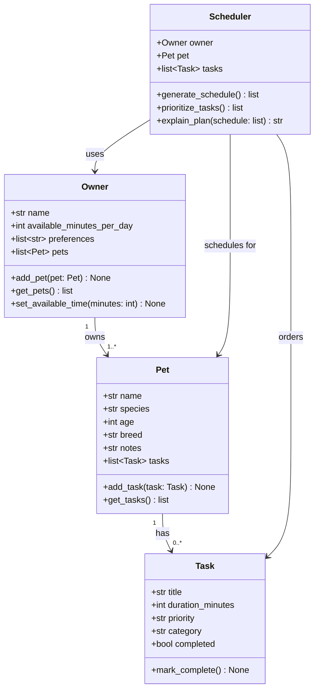

# PawPal+ Project Reflection

## 1. System Design

### Core User Actions

The three core actions a PawPal+ user should be able to perform are:

1. **Register their pet** — Enter basic information about their pet (name, species, age, breed) so the system can tailor care recommendations appropriately.
2. **Add and manage care tasks** — Create tasks like walks, feeding, medication, and grooming, each with a duration (in minutes) and a priority level (low / medium / high).
3. **Generate today's daily care plan** — Ask the system to produce an ordered schedule of tasks that fits within the owner's available time, prioritizing the most important tasks first, and explain why each task was included.

**a. Initial design**

The system is built around four classes:

- **Owner** — Holds the owner's name and their available time per day (in minutes). Maintains a list of pets and any scheduling preferences (e.g., no tasks before 8 AM). Responsible for adding pets and surfacing the constraint of available time to the scheduler.
- **Pet** — Holds the pet's name, species, age, breed, and any owner notes. Owns a list of Task objects and is responsible for adding/retrieving them. Using a Python dataclass keeps the data clean and easy to compare.
- **Task** — A dataclass representing a single care action: title, duration, priority, category (walk/feed/med/grooming/enrichment), and completion status. Lightweight by design — it holds data and can mark itself complete.
- **Scheduler** — The "brain" of the system. It takes an Owner and a Pet, collects their tasks, sorts by priority, and greedily fits tasks into the available time window. It also generates a plain-English explanation of the resulting plan.

**Relationships:** An Owner owns one or more Pets; each Pet has zero or more Tasks; the Scheduler uses the Owner (for time constraints) and the Pet (for tasks) to produce a schedule.

**b. Design changes**

During the skeleton and implementation phases, two refinements emerged:

- **Pet became a dataclass (from a plain class).** The original sketch had `Pet` as a regular class, but since it primarily holds data with only two helper methods, `@dataclass` reduces boilerplate and makes instances directly comparable with `==` — useful for testing. The `tasks` list is declared as `field(default_factory=list)` to avoid the mutable-default-argument bug. Owner stayed a plain class because it has richer initialisation logic that doesn't fit cleanly into dataclass constraints.

- **Scheduler changed from `(owner, pet)` to `(owner)` only.** The initial UML passed a single `Pet` to `Scheduler`, but the project brief says the scheduler should "retrieve, organise, and manage tasks *across* pets" (plural). Passing just an `Owner` is cleaner: `Scheduler` calls `owner.get_all_tasks()` to collect every task from every pet in one step. This also makes it trivial to add a second pet — the scheduler doesn't need to change at all. A new helper `Owner.get_all_tasks()` was added to centralise that aggregation logic.

---

## 2. Scheduling Logic and Tradeoffs

**a. Constraints and priorities**

The scheduler considers two constraints: **priority** (high/medium/low) and the **owner's total available minutes per day**. Priority was chosen as the primary sort key because a pet owner cares more about urgency (medication before enrichment) than about clock time. The daily budget is the hard cap — no task is added once time runs out. A secondary sort by duration (shorter tasks first within the same priority tier) helps fit more tasks into the remaining budget after high-priority items are placed.

**b. Tradeoffs**

The conflict detector only flags tasks that have an explicit `start_time` set. Tasks without a start time are auto-assigned sequential slots by `generate_schedule()` and are therefore guaranteed not to overlap each other — but any manually pre-assigned time is trusted at face value and checked against the rest.

This is a deliberate simplification: checking every possible pair regardless of whether a time was set would produce false positives for tasks that were never actually time-pinned. The tradeoff is that a user who forgets to set `start_time` will not get a conflict warning even if they mentally intend two tasks to overlap — but the app never silently crashes or produces an invalid schedule.

---

## 3. AI Collaboration

**a. How you used AI**

- How did you use AI tools during this project (for example: design brainstorming, debugging, refactoring)?
- What kinds of prompts or questions were most helpful?

**b. Judgment and verification**

- Describe one moment where you did not accept an AI suggestion as-is.
- How did you evaluate or verify what the AI suggested?

---

## 4. Testing and Verification

**a. What you tested**

The test suite (`tests/test_pawpal.py`, 42 tests) covers five categories:

1. **Core model behaviour** — `Task.mark_complete()` sets the flag; `Pet.add_task()` / `get_tasks()` mutate and return correctly; `Owner.get_all_tasks()` aggregates across multiple pets.
2. **Scheduling logic** — greedy scheduler respects the time budget (including exact-fit and one-minute-over boundary conditions), orders by priority, and excludes already-completed tasks.
3. **Sorting and filtering** — `sort_by_time()` produces chronological order with untimed tasks last; `filter_tasks()` narrows by pet name, completion status, or both; edge cases like empty lists and unknown pet names return empty rather than crashing.
4. **Recurring tasks** — daily and weekly `mark_complete()` return the correct next `due_date`; attributes are fully inherited; `complete_task()` automatically appends the recurrence to the pet; non-recurring tasks leave the pet's task count unchanged.
5. **Conflict detection** — two-task overlap is flagged; adjacent (non-overlapping) and untimed tasks produce no warnings; three-way overlaps generate exactly three pairwise warnings; an empty schedule returns `[]`.

These tests matter because the scheduler's value depends entirely on correctness: a wrong priority sort or an off-by-one budget check would silently produce a bad plan that the user might follow without noticing.

**b. Confidence**

Confidence level: ★★★★☆ (4/5)

The core greedy algorithm and all new algorithmic features are well-covered. Confidence is not 5/5 because:

- The Streamlit UI layer (`app.py`) has no automated tests — session-state persistence is only verified manually.
- There are no tests for malformed input (e.g., `start_time="not-a-time"`, negative durations) — the code handles these gracefully for the known paths but it is not systematically verified.

**Edge cases to test next:**
- Tasks with `duration_minutes=0` (should they be included or skipped?).
- An owner with 100+ pets and tasks — performance/scalability check.
- Concurrent `generate_schedule()` calls modifying `start_time` in-place on shared Task objects (potential mutation hazard in the Streamlit session).
- A recurring task chain across several completions to verify the date arithmetic compounds correctly.

---

## 5. Reflection

**a. What went well**

- What part of this project are you most satisfied with?

**b. What you would improve**

- If you had another iteration, what would you improve or redesign?

**c. Key takeaway**

- What is one important thing you learned about designing systems or working with AI on this project?
